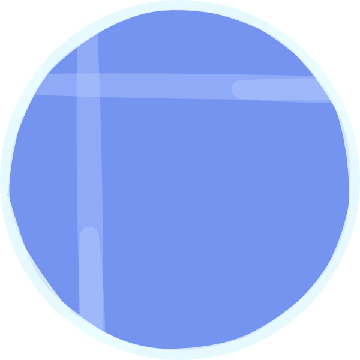

# Hi there! Thanks for checking out CarpetCreate!

<strong>CarpetCreate</strong> is an extension for both [Carpet](https://github.com/gnembon/fabric-carpet) and [Create](https://github.com/Fabricators-of-Create/Create), integrating the two seamlessly into an all-around clockwork technical experience! Besides the ability to modify the behaviours of Create's components to better suit a building environment, <strong>CarpetCreate</strong> offers many bug fixes and enhancements to the existing features, making your playthrough as smooth as it can possibly be!

> A fluid pump extracting lava from a magma block.

For more information and a list of rules, please check out the [CarpetCreate wiki](https://github.com/axialeaa/CarpetCreate/wiki). It has truly all you need to know!
***

### Getting Started
Once you have downloaded [Carpet](https://github.com/gnembon/fabric-carpet) and [Create](https://github.com/Fabricators-of-Create/Create), simply drag Carpet, Create (along with its own dependencies) and <strong>CarpetCreate</strong> into your Fabric mods folder. If you're playing on a multiplayer server, you'll need to have these mods installed on both the server and client sides.
***

### More Carpet Extensions
There are a lot of other Carpet extensions out there, adding countless new rules and functionality! You can find a list of them in the [Carpet wiki](https://github.com/gnembon/fabric-carpet/wiki/List-of-Carpet-extensions).
